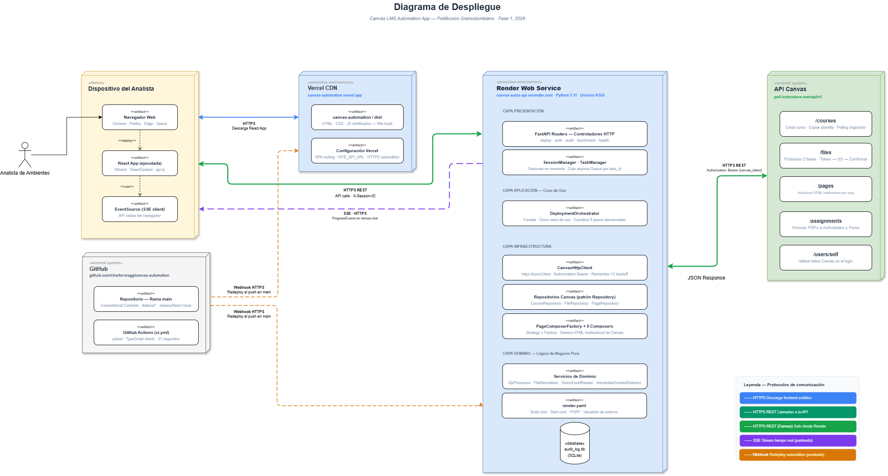
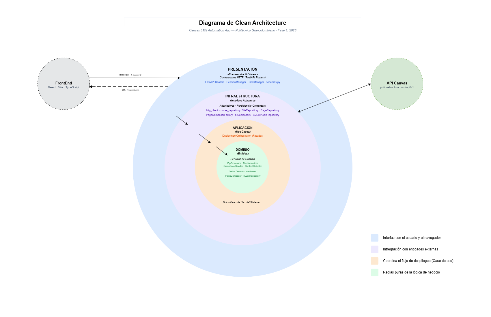
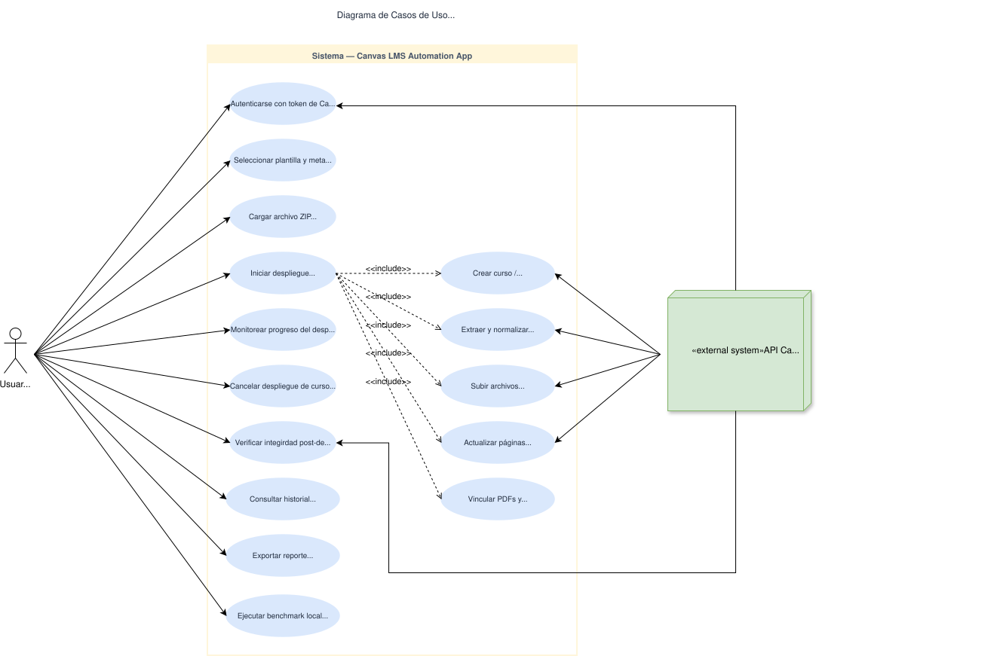
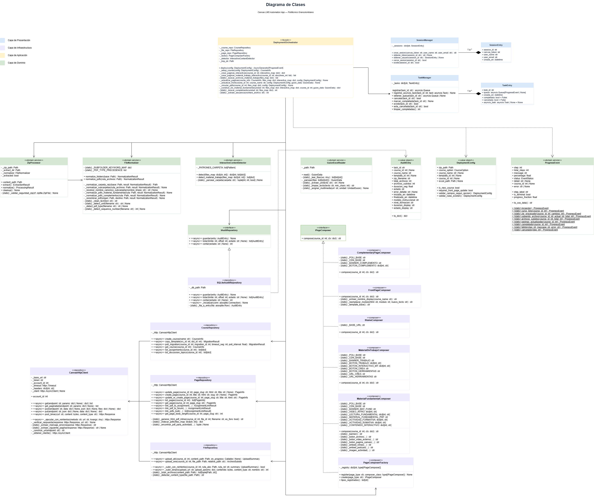
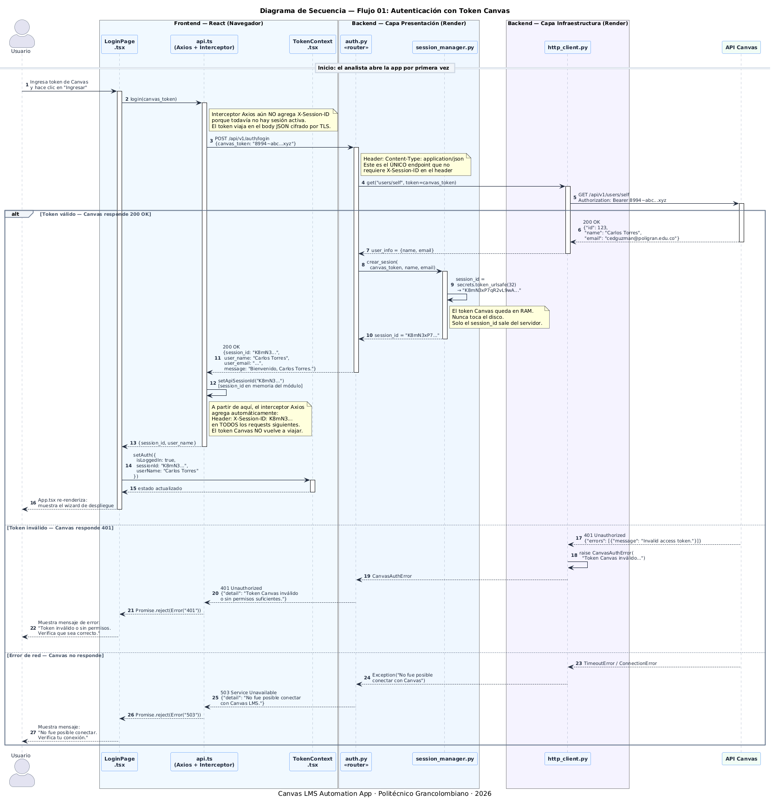
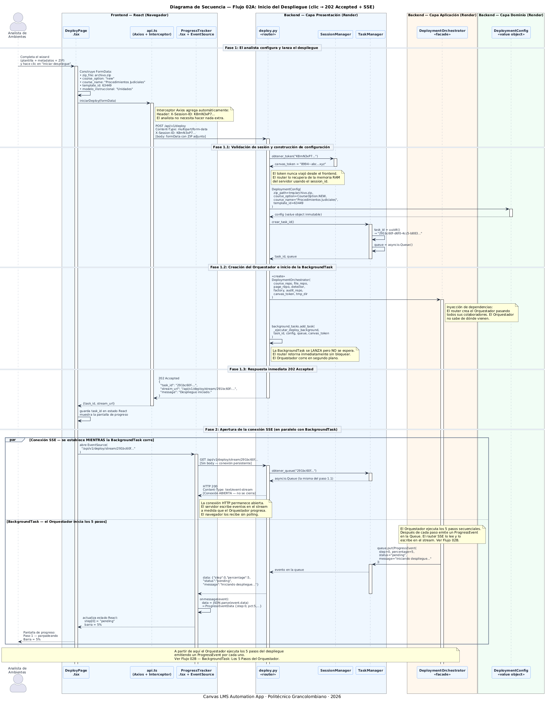
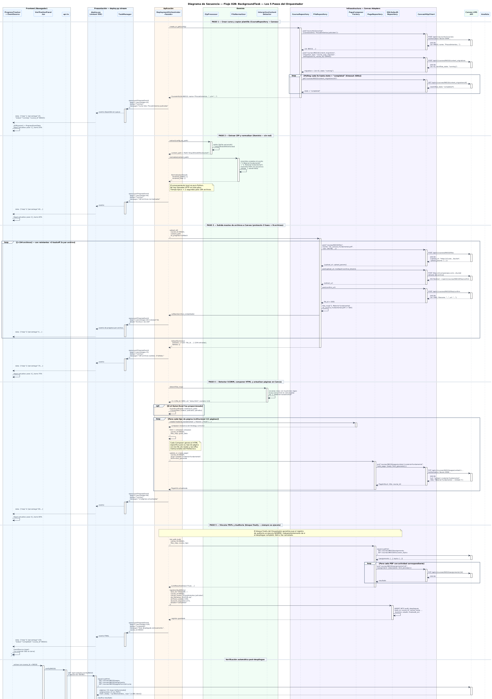

# Diagramas UML — Canvas LMS Automation App

## Diagrama de Despliegue

---

## Diagrama de Arquitectura — Clean Architecture

---

## Diagrama de Casos de Uso

---

## Diagrama de Clases

---

## Diagramas de Secuencia

??? note "Flujo 01 — Autenticación"

    

??? note "Flujo 02A — Inicio del despliegue"

    

??? note "Flujo 02B — BackgroundTask: Despliegue del Aula"

    